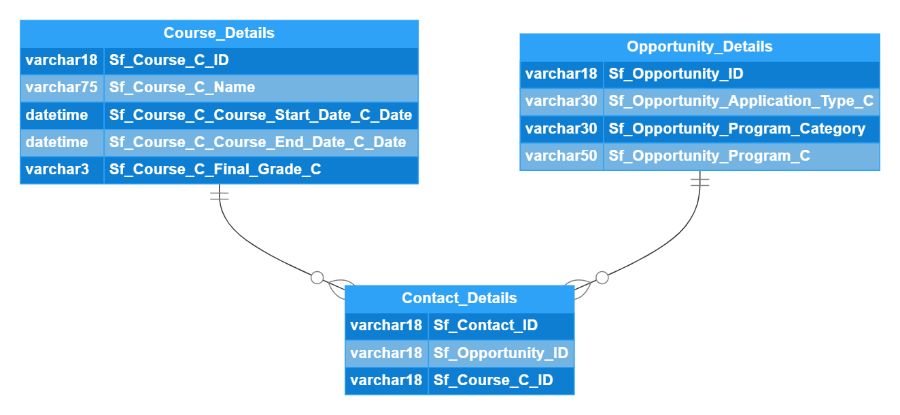

# guild_proj

## Instructions
- [Follow to PDF.](Analytics_Engineer_Candidate_Project.pdf)

## Installation
- [Install Anaconda.](https://docs.anaconda.com/anaconda/install/index.html)
- [Paste these commands where you have an anaconda base active.](install_instructions.txt)

## Analysis
- [Follow to Notbook.](Guild_Project.ipynb)
- ER Diagram:

\
- [SQL_QUERIES.txt](SQL_QUERIES.txt)
- [notes.txt](notes.txt)
